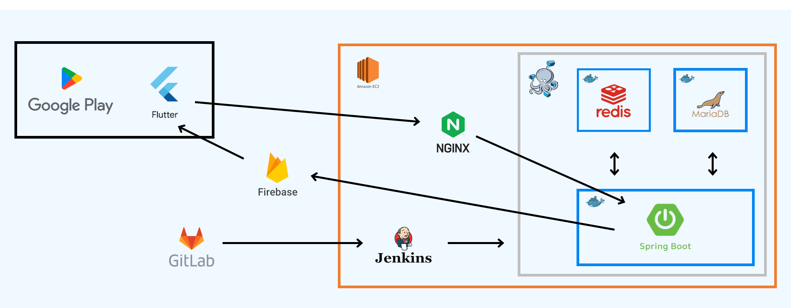
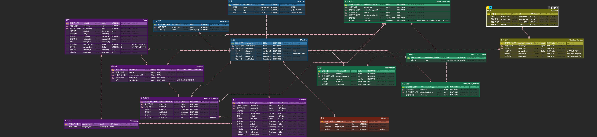

{: height="500px", width="700px"}

# :sparkles: 킹메이커
### “왕이 되고 싶은 자, 일상의 무게를 견뎌라!” 

    왕 캐릭터 키우기를 통해 계획한 하루 일정을 달성할 수 있도록 동기를 부여하고, 알림을 통해 업무를 잊지 않도록 도와주는 서비스

## :bulb: [기능소개]
### [소셜 로그인]
    1) 카카오 로그인
    2) 구글 로그인 

### [일정 관리]
카테고리별(집안일/일상/학습/건강/업무/기타) 

    1) 할 일(일반 업무)
    2) 루틴(주기성 업무)

-> 일정 달성 시 백성 수 증가/미달성 시 백성 수 차감

### [캘린더] 
일정 개수별 6단계로 색 변화 확인 가능

### [알림]
    1) 아침 알림(오전 8시) 
    2) 저녁 알림(오후 9시)
    3) 일정 알림(일정 1시간 전)
    4) 어제 미달성 업무 알림(오전 9시)

### [업적]
    1) 밀림의 왕: 미달성한 일정 50개 도달
    2) 나무늘보도 너보다는 부지런하겠다: 미달성한 일정 100개 도달
    3) 죽은 자의 소생: 마지막 수행으로부터 30일 이상 지난 경우
    4) 나름 인정받는 국왕: 백성 수 3000명 도달
    5) 여기가...맞나요?: 성으로 변경되는 단계에 도달
    6) 오늘부터 황제: 만렙에 도달
    7) 알록달록한 세상: 카테고리별 달성 1개씩
    8) 오잉!? 할 일의 상태가...!: 중요도 상인 일정 1개 최초 수행
    9) 내가 이세계 국왕?: 최초 가입
    10) 이게...내가 지닌 힘?: 첫 몬스터 처치
    11) 루틴 부자: 루틴 20개 생성
    12) 할 일 만수르: 할 일 100개 생성
    13) 몬스터 파크 개장: 오늘 일정이 30개에 도달
    14) 00월 국가브랜드평판 S: 전월 달성률이 90% 이상

### [일정 리포트]
    1) 오늘의 달성률
    2) 월간 달성률
    3) 연간 달성률
    4) 최다 달성 카테고리
    5) 최소 달성 카테고리
    6) 성과 달력(매일의 달성률)

## :bulb: 기술 스택

### Cooperation

### Tools
 

### Infra

### BackEnd

### FrontEnd

## :bulb: 아키텍처
{: height="500px", width="700px"}

## :bulb: ERD
{: height="500px", width="700px"}

## :bulb: 팀원 소개
